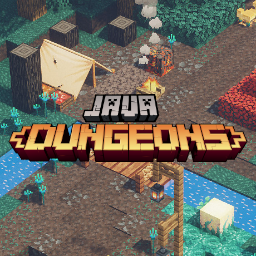

# JavaDungeons

   

 

JavaDungeons is a Fabric mod that adds the custom blocks from Minecraft Dungeons into Minecraft: Java Edition. Most textures are not made by me, and they were obtained from Minecraft: Dungeons. 

### Texture Rights

Most textures are ripped from Minecraft: Dungeons. All Dungeons texture rights go to the MC: Dungeons team (except for custom textures like seen in the Dimensional Rectifier). Some have to be composited together manually by me due to how they handle texturing and materials in Dungeons, and there are a few textures that I've partially handcrafted based on what I've seen in the game because I can't find a texture file or material definition for it. All models are either based off model definitions from the game, or estimated from what they look like in the game. 

### Naming of blocks

All blocks are named based on what I think they're closest to in Minecraft, unless they have a name in Dungeons or are just obvious as to what they are. Blocks are categorized under what category they're put under in the game files (so files tagged creeper woods will be put in the creeper woods category, etc.), or where they're most found ingame.

### What will be added from Dungeons?

Primarily blocks, with a few entities maybe. I will not add a block if it's too close to vanilla, so blocks with very slight variations in color or slight changes to the shape won't be added. Some entities might be added, if they have slight variations from vanilla (like the creeper) or if I just think they're cool. They'll probably behave identical to their vanilla counterparts. There will also be a few custom blocks for survival functionality, so you can obtain the blocks in survival.
